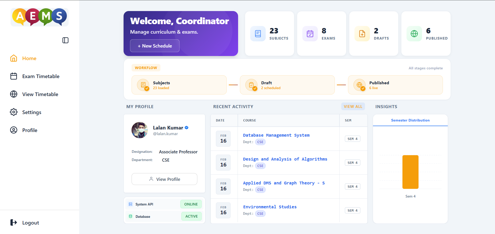
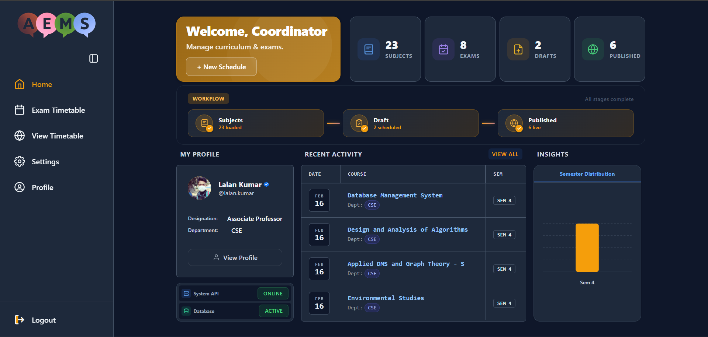
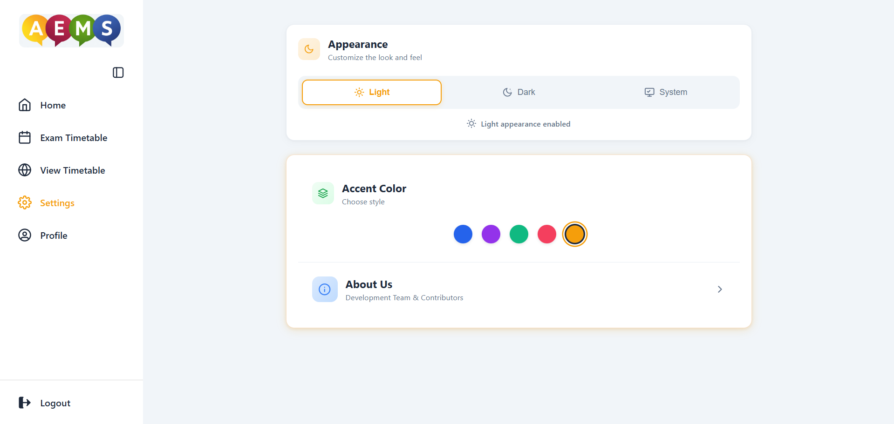
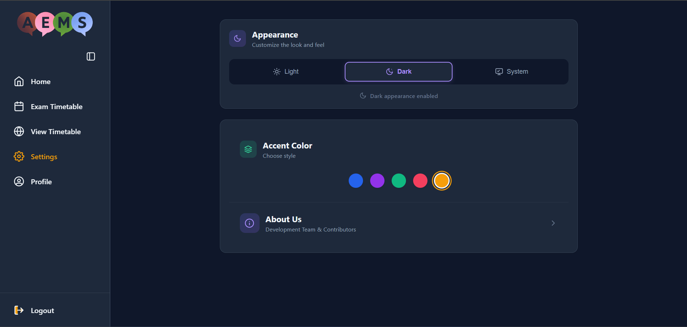
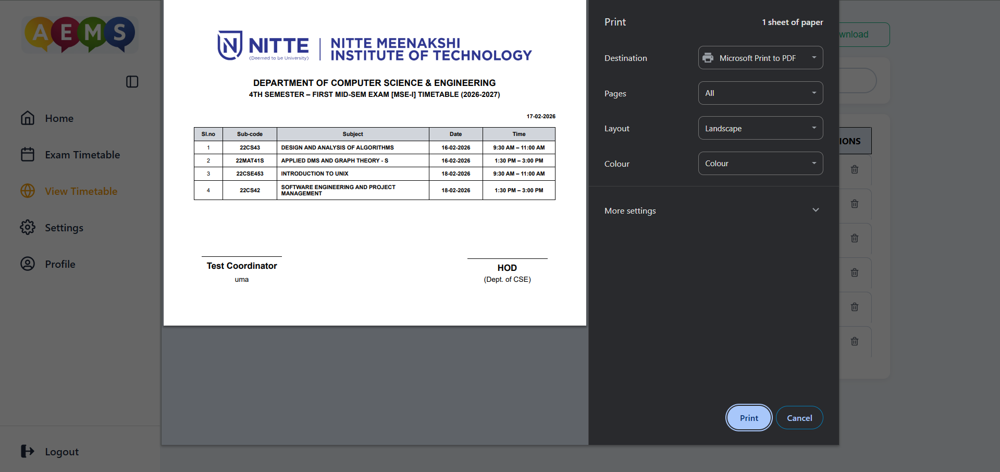

# Automated Exam Management System (AEMS)

A comprehensive web application for scheduling and managing academic exams efficiently.


##  Tech Stack
- **React**: User Interface Library
- **Spring Boot**: Java Application Framework
- **MongoDB**: Document-Oriented Database
- **Vite**: Frontend Build Tool

##  Getting Started

Follow these steps to set up the project locally.

### Prerequisites
- **Node.js**: v18 or higher
- **Java**: JDK 21
- **MongoDB**: Running locally or via Atlas

### 1. Database Setup
Ensure your local MongoDB instance is running.

### 2. Backend Setup
Navigate to the backend directory and start the Spring Boot application.

```bash
cd backend
# Run using Maven wrapper
./mvnw spring-boot:run
```
*The backend server will start at `http://localhost:8080`*

### 3. Frontend Setup
Navigate to the frontend directory, install dependencies, and start the development server.

```bash
cd frontend
# Install dependencies
npm install
# Start the dev server
npm run dev
```
*The frontend application will run at `http://localhost:5173`*

## 📸 Screenshots

### Dashboard
| Light Mode | Dark Mode |
| --- | --- |
|  |  |


### Settings & Customization
| Light Mode | Dark Mode |
| --- | --- |
|  |  |

### Print Preview



## 🤝 Contributing

Contributions are welcome! Please feel free to submit a Pull Request.

